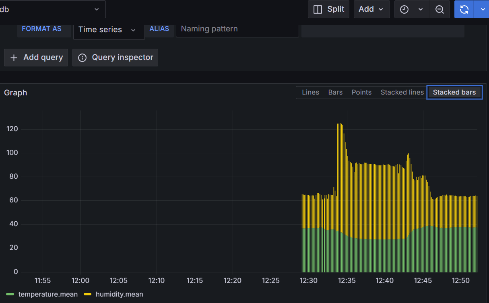
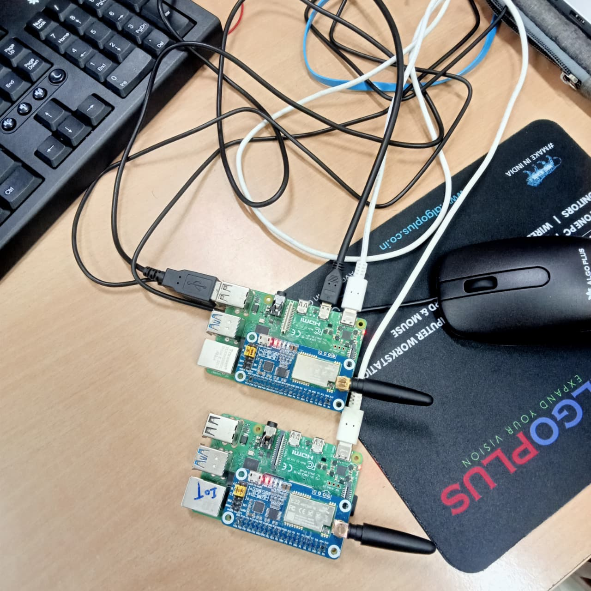
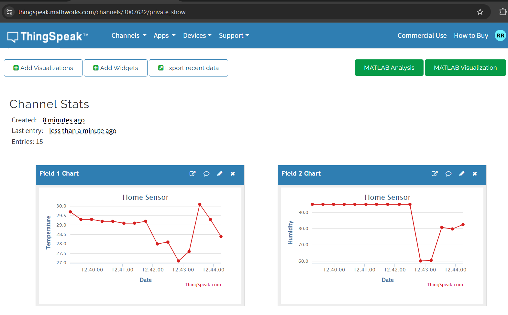
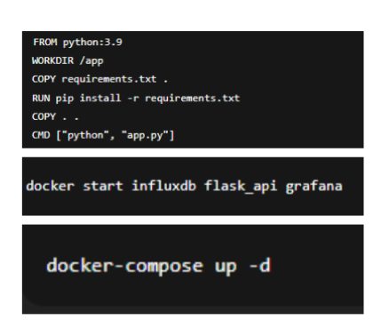
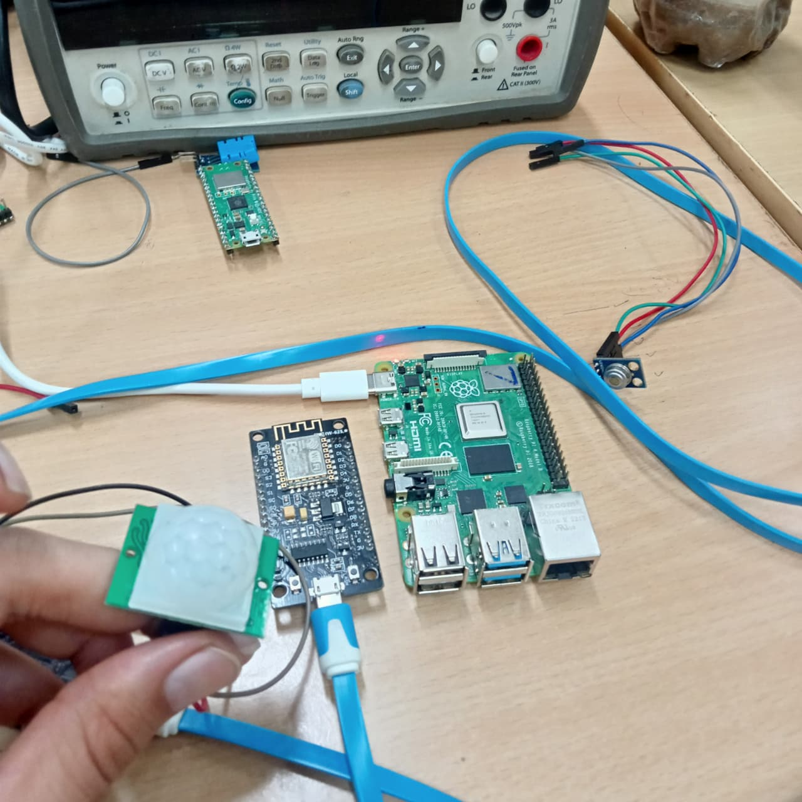
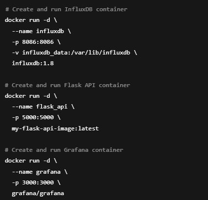

# Scalable IoT Monitoring System

## 📌 Project Title
Design and Implementation of a Scalable IoT Monitoring System Using Multi-Protocol Communication and Real-Time Visualization

## 🚀 Description
This project is an IoT-based monitoring system that collects real-time data from sensors using ESP8266 and sends it through MQTT protocol to a server. The data is stored in InfluxDB and visualized using Grafana dashboards.

## 🛠️ Technologies Used
- ESP8266
- MQTT Protocol
- InfluxDB
- Grafana
- Python / Flask (if used)

## 📊 Features
- Real-time sensor data monitoring
- Multi-protocol communication
- Data storage and visualization
- Scalable architecture

## 📁 Project Structure
- CODE → Source code files
- IMAGES → Project images / diagrams
- Report PDF → Detailed documentation

## 📷 Project Screenshot

## 📄 Project Report
Included in this repository

## 👨‍💻 Author
Govind Singh Rathore
